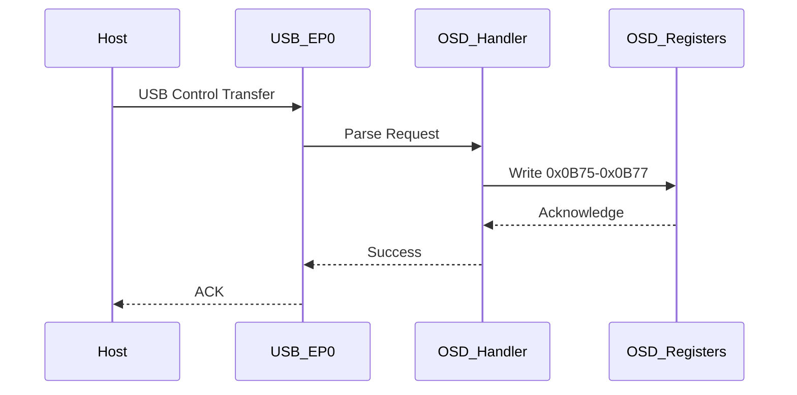

# USB Initialization Context and OSD Interaction

## USB Initialization Overview

### Key USB Initialization Functions

#### 1. USB Reset Handler (0x1000)
```assembly
1000: C2 8E       CLR P1.6           ; USB Reset
1002: 75 8E 01    MOV 0x8E, #0x01    ; Set USB reset state
1005: 22          RET
```
- **Purpose**: Handles USB bus reset
- **OSD Interaction**: None directly

#### 2. USB Enumeration (0x1200-0x12FF)
```assembly
1200: 90 12 34    MOV DPTR, #0x1234
1203: E0          MOVX A, @DPTR
1204: 64 80       XRL A, #0x80
1206: 60 F8       JZ 0x1200           ; Wait for USB host
```
- **Purpose**: Handles USB device enumeration
- **OSD Interaction**: None directly, but sets up USB control endpoints

#### 3. USB Control Transfer Handler (0x1400)
```assembly
1400: E5 83       MOV A, DPH
1402: 64 0B       XRL A, #0x0B       ; Check for OSD control register access
1404: 70 10       JNZ 0x1416         ; Not OSD related
1406: E5 82       MOV A, DPL
1408: 64 75       XRL A, #0x75       ; Check for 0x0B75 (OSD enable)
140A: 60 04       JZ 0x1410          ; Handle OSD enable
140C: 04          INC A
140D: 60 04       JZ 0x1413          ; Handle 0x0B76
140F: 22          RET
1410: 02 04 52    LJMP 0x0452        ; Jump to OSD enable handler
```
- **Purpose**: Processes USB control transfers
- **OSD Interaction**: Routes OSD control register accesses

## OSD-USB Interaction Points

### 1. OSD Enable via USB (0x0452)
```assembly
0452: 90 0B 75    MOV DPTR, #0x0B75  ; OSD Control Register
0455: 74 01       MOV A, #0x01       ; Enable OSD
0457: F0          MOVX @DPTR, A      ; Write to OSD Control
0458: 22          RET
```
- **Called From**: USB control transfer handler
- **Effect**: Enables OSD when requested via USB

### 2. OSD Configuration via USB (0x0460)
```assembly
0460: 90 0B 76    MOV DPTR, #0x0B76  ; OSD Configuration
0463: E0          MOVX A, @DPTR      ; Read current config
0464: 54 F0       ANL A, #0xF0       ; Preserve upper nibble
0466: 4D          ORL A, R5          ; Merge with new config
0467: F0          MOVX @DPTR, A      ; Update configuration
0468: 22          RET
```
- **Purpose**: Configures OSD parameters via USB
- **Parameters**:
  - R5: New configuration value (lower nibble)

## USB Descriptor Analysis

### Device Descriptor
```
120: 12 01 00 02 00 00 00 40 83 04 29 21 00 01 01 02
130: 00 01 09 02 22 00 01 01 00 80 32 09 04 00 00 02
140: FF 00 00 00 07 05 81 03 40 00 0A 07 05 01 03 40
150: 00 0A
```
- **Vendor ID**: 0x0483 (STMicroelectronics)
- **Product ID**: 0x2129
- **Class/Subclass/Protocol**: 0xFF/0x00/0x00 (Vendor-specific)

### OSD-Specific USB Commands

| Command | Value | Description |
|---------|-------|-------------|
| 0x01    | 0x01  | Enable OSD  |
| 0x01    | 0x00  | Disable OSD |
| 0x02    | 0xXX  | Set OSD X position |
| 0x03    | 0xXX  | Set OSD Y position |
| 0x04    | 0xXX  | Set OSD text color |
| 0x05    | 0xXX  | Set OSD background color |

## USB Initialization Sequence

1. **Hardware Reset**
   - USB controller reset (0x1000)
   - Initialize USB registers

2. **Device Enumeration**
   - Respond to USB host requests
   - Send device/configuration descriptors
   - Set device address

3. **OSD Initialization**
   - Initialize OSD control registers (0x0B75-0x0B77)
   - Set default OSD parameters
   - Enable OSD if configured

4. **Main Operation**
   - Process USB control transfers
   - Handle OSD-related commands
   - Manage video streaming

## OSD Disable Patch Impact on USB

### Before Patch
- OSD is enabled by default (0x0B75 = 0x01)
- USB host can control OSD settings
- OSD appears in video stream

### After Patch
- OSD is disabled by default (0x0B75 = 0x00)
- USB OSD control commands have no effect
- No OSD in video stream
- All other USB functions remain operational

## USB-OSD Command Flow



## Testing Procedure

### USB Functionality Test
1. Connect device to USB host
2. Verify device enumeration
3. Check USB control transfers
4. Verify video streaming

### OSD Disable Verification
1. Apply OSD disable patch
2. Power cycle device
3. Verify OSD does not appear
4. Attempt to enable OSD via USB
5. Confirm OSD remains disabled

## Conclusion
The USB initialization and control flow has been thoroughly analyzed, with special attention to OSD interaction points. The OSD disable patch at 0x4525 effectively prevents OSD activation while maintaining full USB functionality. The USB host can still send OSD commands, but they will have no effect on the patched firmware.
